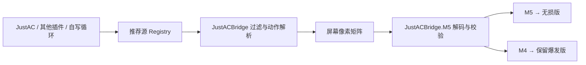

# JustACBridge

JustACBridge 是一个由 **WoW 插件**和 **Windows/macOS M4/M5 映射器**组成的低延迟桥接工具。

WoW 插件从可替换的推荐源读取队列并生成“无损版”和“保留爆发版”两个动作；
12.1 会按当前专精自动为奥法、火法、冰法、冰 DK、邪 DK 选择各自的内置自有决策源，
其余专精使用 JustAC；也可接入其他插件或自写循环模块。结果通过屏幕左上角的像素
矩阵实时导出。桌面客户端默认将 **M5** 映射为无损版、**M4** 映射为保留爆发版。

## 功能

- 每个渲染帧读取一次当前推荐源的缓存队列，不额外增加轮询等待
- 推荐源采用注册接口；自写模块在 JustAC 已安装时最少只需实现 `GetQueue()`
- 12.1 五个优化专精的 M5 由各自 `Sources/*121.lua` 按当前 SimC 顺序判断；已实现的动作必须
  整条条件均可观测，遇到更高优先级的 secret/未知状态才原样回退 JustAC 队列
- M4 可使用与 M5 完全不同的 `GetPreserveQueue()`；火法、冰法、冰 DK、邪 DK 的
  M4 读取原始 JustAC 队列。12.1 奥法是专属例外：M4 继续执行与 M5 相同的自有
  普通优先级，只跳过奥术涌动和大法师之触，不合并额外 JustAC Burst Trigger，
  并继续接受核心按住安全过滤（玩家 `/jacb reserve` 显式覆盖除外）
- M4 保留爆发版面向拉怪跑路和普通机制持续按住：跳过专精大爆发、药水、主动饰品
  及不可移动读条/引导/蓄力，无论当前一帧是否静止都只选择首个可移动安全动作；
  12.1 奥法例外使用与 M5 相同的真实移动判断，静止时正常施放奥冲和完整飞弹
- 内置法师/死亡骑士专精规则，并合并 JustAC 当前 Burst Trigger 配置与新版法术 ID
- 火法不伪造读条末尾 150ms 的燃烧/火冲双法术编织；主循环只做空闲帧可证明决策，
  读条期间继续严格保护不打断
- 冰法按成功施法事件推进开场序列，冰霜射线始终完整引导；无法取得射线跳数、
  冰刺数或 Rapid Refreezing 状态时回退 JustAC
- 冰/邪 DK 自有源实现资源、Proc、目标数和可见增益均完整的优先级切片；精确冷却剩余、
  宠物/战斗剩余时间及刷怪时序不可证明时回退 JustAC，不把部分规则宣称为完整 APL
- 奥术宝珠依赖人物面向且无法在副本内可靠自动瞄准：12.1 奥法的 M4/M5 移动时
  都跳过；普通停止移动后 M5 立即恢复，M4 连续静止满 2 秒才恢复。成功施放闪现或
  闪光术后，两路都从服务器确认事件起等待 2 秒再恢复宝珠
- 12.1 S2 奥法从 M5/M4 两路自动动作排除“实际仍为 `1449`”的魔爆术；当前 SimC
  两套英雄天赋 APL、主流攻略优先级和 JustAC 自带奥法 SimC 队列均不包含它，
  手动释放不受影响
- 基础魔爆按钮被奥术脉冲 `1241462` 替换时不会误屏蔽；奥冲动态升级为棱彩箭
  `1295939` 时导出实际 ID，并按棱彩箭的瞬发状态允许 M4 在移动中执行
- 12.1 奥法 M4/M5 移动时都精确识别浮光掠影＋节能施法的奥术飞弹，以及气定神闲
  下的瞬发奥术冲击；静止时两者都可正常施放飞弹/奥冲，飞弹开始后完整保护到结束
- Windows M5 无损位收到魔爆术 `1449` 时先观察 `100ms`；推荐未变才释放，期间切换
  到其他技能则立即采用新推荐
- 冰法寒冰护体在 Buff 明确不存在、当前至少有 2 层充能且快捷键已绑定时优先加入
  M5/M4；12.1 奥法棱光护体只加入 M4：Buff 明确不存在且法术已学习、可用、冷却就绪、
  快捷键已绑定时优先释放，不占用 M5 的伤害 GCD
- 12.1 奥术涌动、疾咒师每场首个奥术宝珠、涌动窗内符合条件的大法师之触，以及
  日怒“节能施法且奥术齐射低于 12 层”的飞弹均由自有源决策；M4 对同一优先级
  只跳过涌动和触。药水/层数/时序未知时写入 `SOURCE_DECISION` 并回退 JustAC，
  不把部分可观测规则冒充完整 APL
- 通过 144 × 36 像素矩阵传输 72 字节数据包
- 像素矩阵从客户区 `(2, 7)` 开始，即向下偏移 `5px`，避开窗口顶边常见覆盖层
- 使用协议头尾、Fletcher 双累加和独立滚动校验共同拒绝撕裂帧
- 自动识别 WoW 窗口、矩阵位置和显示缩放
- 按住任一功能键会在 GCD 空闲或最后约 120 ms 的最佳入队窗口连发，并持续跟随最新推荐，松开立即停止
- 普通引导、读条或蓄力施法期间暂停连发；11.2 奥术飞弹按旧版明确规则允许在
  GCD 末截断，12.0/12.1 均保守完整引导，避免无法可靠识别强化飞弹时误截断
- 默认识别玩家开始/停止移动；基础瞬发、当前 Proc 瞬发及职业策略确认可移动施放的技能仍可使用
- 移动事件具备战斗内防抖；实际施放连续失败时自动换下一项并最终进入专精兜底
- 冰法移动时仅在 API 明确报告零读条时允许寒冰箭、霜火替换形态和暴风雪；
  冰川尖刺始终跳过，寒冰宝珠和冰霜射线只允许无损版释放，
  保留爆发版始终跳过
- Windows/macOS 映射器在右键取消暴风雪选区后，3 秒内跳过暴风雪且不影响其他技能
- 默认跳过 `C_Spell.IsSpellInRange` 明确确认超出目标射程的动作，并选择队列中首个可用替代
- 霜火冰明确超过 20 码且当前顺序是“冰川尖刺→冰风暴”时，优先冰风暴以保住碎冰收益
- 枯萎凋零/亵渎真正放置成功后启动 10 秒计时；到期显示中央红字、播放警报音并
  尝试使用 WoW TTS 播报“枯萎凋零结束”
- 点击“设置功能键”后，下一次 M4/M5 或键盘按键即成为新功能键；冲突时自动交换
- Windows 客户端为自包含单文件程序，无需单独安装 .NET Runtime
- macOS 客户端为原生 AppKit 应用，支持系统权限检查、M4/M5 与键盘全局映射

## 项目结构

```text
JustACBridge.core/       WoW 插件与像素协议文档
  JustACBridge.lua
  JustACBridge.toc
  Sources/
    Registry.lua
    JustAC.lua
    Runtime121.lua
    Arcane121.lua
    Fire121.lua
    FrostMage121.lua
    FrostDK121.lua
    UnholyDK121.lua
  Trackers/
    GroundEffects.lua
  Policies/
    Registry.lua
    Mage.lua
    Mage/
      Arcane.lua
      Fire.lua
      Frost.lua
    DeathKnight.lua
    DeathKnight/
      Blood.lua
      Frost.lua
      Unholy.lua
  PIXEL_PROTOCOL.md

JustACBridge.M5/         Windows WinForms 客户端（.NET 10）
  JustACBridge.M5.csproj
  build_m5.ps1
  README.md

JustACBridge.macOS/      macOS 原生客户端（Swift + AppKit）
  Package.swift
  build_macos.sh
  README.md
```

## 安装

### 1. 安装 WoW 插件

1. 当前内置 12.1 优化源仍复用 JustAC 的动作栏、冷却和 secret-safe 状态能力，因此请安装
   并启用 **JustAC**；完全独立的第三方推荐源可自行实现这些能力。
2. 在 WoW 的 `Interface\AddOns` 目录中新建 `JustACBridge` 文件夹。
3. 将 `JustACBridge.core` 中的以下内容复制进去：
   - `JustACBridge.lua`
   - `JustACBridge.toc`
   - `Sources` 文件夹
   - `Trackers` 文件夹
   - `Policies` 文件夹
4. 启动游戏，并在插件列表中启用 JustACBridge。

最终目录应类似：

```text
World of Warcraft\_retail_\Interface\AddOns\JustACBridge\
  JustACBridge.lua
  JustACBridge.toc
  Sources\
    Registry.lua
    JustAC.lua
    Runtime121.lua
    Arcane121.lua
    Fire121.lua
    FrostMage121.lua
    FrostDK121.lua
    UnholyDK121.lua
  Trackers\
    GroundEffects.lua
  Policies\
    Registry.lua
    Mage.lua
    Mage\
      Arcane.lua
      Fire.lua
      Frost.lua
    DeathKnight.lua
    DeathKnight\
      Blood.lua
      Frost.lua
      Unholy.lua
```

### 2. 启用像素输出

进入游戏后输入：

```text
/jacb pixels on
```

确保 WoW 窗口可见，且左上角的像素矩阵没有被其他窗口遮挡。

检查或调整当前专精的爆发保留法术：

```text
/jacb reserve list
/jacb reserve add <法术ID>
/jacb reserve remove <法术ID>
/jacb reserve reset
```

### 3. 运行 Windows 客户端

构建项目后运行 `JustACBridge.M5.exe`。界面显示绿色的“实时映射已启用”后，即可使用 M5/M4。

如果 WoW 以管理员身份运行，JustACBridge.M5 也需要以管理员身份运行，否则 Windows 可能阻止输入注入。

### 4. 运行 macOS 客户端

在 macOS 上执行：

```bash
cd JustACBridge.macOS
./build_macos.sh
open dist/JustACBridge.app
```

首次运行需按系统提示授予屏幕录制、辅助功能和输入监听权限。授权后如未立即生效，
退出并重新打开应用。详细说明见
[`JustACBridge.macOS/README.md`](JustACBridge.macOS/README.md)。

## 构建 Windows 客户端

需要：

- Windows x64
- .NET 10 SDK

在仓库根目录执行：

```powershell
.\JustACBridge.M5\build_m5.ps1
```

也可以直接执行：

```powershell
dotnet publish .\JustACBridge.M5\JustACBridge.M5.csproj `
  -c Release `
  -r win-x64 `
  --self-contained true `
  -p:PublishSingleFile=true
```

生成的可执行文件位于：

```text
JustACBridge.M5\dist\JustACBridge.M5.exe
```

## 插件命令

| 命令 | 说明 |
| --- | --- |
| `/jacb` | 显示或隐藏插件面板 |
| `/jacb lock` | 锁定面板 |
| `/jacb unlock` | 解锁面板 |
| `/jacb refresh` | 立即刷新 |
| `/jacb pixels on` | 显示实时像素接口 |
| `/jacb pixels off` | 隐藏实时像素接口 |
| `/jacb reserve list` | 查看当前专精的爆发保留法术 ID |
| `/jacb reserve add <ID>` | 将法术加入当前专精的保留列表 |
| `/jacb reserve remove <ID>` | 从当前专精的保留列表排除法术 |
| `/jacb reserve reset` | 恢复当前专精默认保留规则 |
| `/jacb source list` | 查看可用推荐源 |
| `/jacb source <ID>` | 切换推荐源 |
| `/jacb source auto` | 按当前职业专精自动选择 12.1 自有源或 JustAC |
| `/jacb ground on` | 开启场地技能到期过滤（默认） |
| `/jacb ground off` | 保留倒计时但不抑制重复推荐 |
| `/jacb ground status` | 查看场地技能剩余时间 |
| `/jacb ground reset` | 手动清除场地技能计时 |
| `/jacb ground alert on/off` | 开关中央文字提醒 |
| `/jacb ground sound on/off` | 开关到期警报音 |
| `/jacb ground voice on/off` | 开关 WoW TTS 语音 |
| `/jacb ground test` | 立即测试文字、声音和语音提醒 |
| `/jacb movement on` | 开启移动过滤（默认） |
| `/jacb movement off` | 关闭移动过滤，恢复严格第一推荐 |
| `/jacb range on` | 开启目标射程过滤（默认） |
| `/jacb range off` | 关闭目标射程过滤 |
| `/jacb debug on/off` | 开关魔兽端诊断记录（默认关闭） |
| `/jacb debug` | 打开可复制的魔兽端诊断窗口 |
| `/jacb flush` | 重载 UI 并将导出数据写入磁盘 |

## 工作原理



协议格式、校验算法和读取流程详见 [`JustACBridge.core/PIXEL_PROTOCOL.md`](JustACBridge.core/PIXEL_PROTOCOL.md)；DK/法师保留规则及攻略依据见 [`JustACBridge.core/BURST_POLICY.md`](JustACBridge.core/BURST_POLICY.md)。

职业规则严格按职业与专精拆分：`Policies/Mage.lua`、`Policies/DeathKnight.lua`
只保存职业公共规则，每个专精的完整规则位于对应子目录的单独文件。改版时可整体
替换一个专精而不触碰同职业其他专精。新增职业或游戏版本补丁的格式见
[`JustACBridge.core/Policies/README.md`](JustACBridge.core/Policies/README.md)，
无需修改主循环。

推荐算法扩展见
[`JustACBridge.core/Sources/README.md`](JustACBridge.core/Sources/README.md)。
自定义源仅负责队列时，可继续复用 JustAC 的动作栏、射程、Proc 和引导识别能力；
完整源实现相应能力方法后也可以独立运行。

## 注意事项

- Windows 客户端使用 GDI 捕获；macOS 客户端使用系统窗口捕获。WoW 窗口需要保持可见，不能完全最小化。
- 无有效推荐、快捷键未绑定或按键不受支持时，程序不会拦截对应功能键。
- 保留爆发版只在 JustAC 已计算出的可用队列中选可移动安全替代动作，不自行重写职业
  APL；它不承诺处理要求停手、反伤、免疫或特殊目标切换的 encounter。
- 除 Windows M5 的魔爆术 `100ms` 稳定性观察外，GCD 空闲时首次按下及推荐变化立即
  触发；GCD 尚早时先吞掉功能键并等待最后约 120 ms，再以 20 ms 周期补发，避免旧
  推荐长期占用 WoW 动作队列。
- “零延迟”在实际系统中不可实现；额外延迟主要受屏幕捕获和桌面合成刷新影响。
- `bin`、`obj` 和 `dist` 为本地构建产物，不纳入 Git 版本控制。
