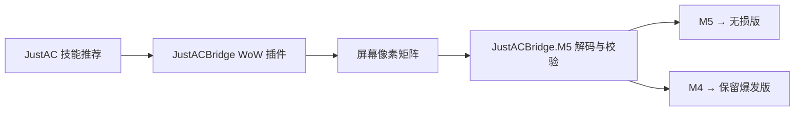

# JustACBridge

JustACBridge 是一个由 **WoW 插件**和 **Windows M5 映射器**组成的低延迟桥接工具。

WoW 插件读取 JustAC 队列并生成“无损版”和“保留爆发版”两个动作，通过屏幕左上角的像素矩阵实时导出。Windows 客户端默认将 **M5** 映射为无损版、**M4** 映射为保留爆发版；两个功能键均可点击设置按钮后，用下一次按键重新绑定。

## 功能

- 每个渲染帧读取一次 JustAC 缓存队列，不额外增加轮询等待
- M5 无损版严格执行 JustAC 第一推荐
- M4 保留爆发版跳过专精大爆发、药水及主动饰品，选择首个当前可用的非保留动作
- 内置法师/死亡骑士专精规则，并合并 JustAC 当前 Burst Trigger 配置
- 通过 144 × 36 像素矩阵传输 72 字节数据包
- 使用协议头尾、Fletcher 双累加和独立滚动校验共同拒绝撕裂帧
- 自动识别 WoW 窗口、矩阵位置和显示缩放
- 按住任一功能键会立即施放并持续跟随最新推荐连发，松开立即停止
- 引导、读条或蓄力施法期间暂停连发且吞掉功能键事件，施法结束后若仍按住则自动继续
- 点击“设置功能键”后，下一次 M4/M5 或键盘按键即成为新功能键；冲突时自动交换
- Windows 客户端为自包含单文件程序，无需单独安装 .NET Runtime

## 项目结构

```text
JustACBridge.core/       WoW 插件与像素协议文档
  JustACBridge.lua
  JustACBridge.toc
  PIXEL_PROTOCOL.md

JustACBridge.M5/         Windows WinForms 客户端（.NET 10）
  JustACBridge.M5.csproj
  build_m5.ps1
  README.md
```

## 安装

### 1. 安装 WoW 插件

1. 确保已经安装并启用 **JustAC**。
2. 在 WoW 的 `Interface\AddOns` 目录中新建 `JustACBridge` 文件夹。
3. 将 `JustACBridge.core` 中的以下文件复制进去：
   - `JustACBridge.lua`
   - `JustACBridge.toc`
4. 启动游戏，并在插件列表中启用 JustACBridge。

最终目录应类似：

```text
World of Warcraft\_retail_\Interface\AddOns\JustACBridge\
  JustACBridge.lua
  JustACBridge.toc
```

### 2. 启用像素输出

进入游戏后输入：

```text
/jacb pixels on
```

确保 WoW 窗口可见，且左上角的像素矩阵没有被其他窗口遮挡。

检查或调整当前专精的爆发保留法术：

```text
/jacb reserve list
/jacb reserve add <法术ID>
/jacb reserve remove <法术ID>
/jacb reserve reset
```

### 3. 运行 Windows 客户端

构建项目后运行 `JustACBridge.M5.exe`。界面显示绿色的“实时映射已启用”后，即可使用 M5/M4。

如果 WoW 以管理员身份运行，JustACBridge.M5 也需要以管理员身份运行，否则 Windows 可能阻止输入注入。

## 构建 Windows 客户端

需要：

- Windows x64
- .NET 10 SDK

在仓库根目录执行：

```powershell
.\JustACBridge.M5\build_m5.ps1
```

也可以直接执行：

```powershell
dotnet publish .\JustACBridge.M5\JustACBridge.M5.csproj `
  -c Release `
  -r win-x64 `
  --self-contained true `
  -p:PublishSingleFile=true
```

生成的可执行文件位于：

```text
JustACBridge.M5\dist\JustACBridge.M5.exe
```

## 插件命令

| 命令 | 说明 |
| --- | --- |
| `/jacb` | 显示或隐藏插件面板 |
| `/jacb lock` | 锁定面板 |
| `/jacb unlock` | 解锁面板 |
| `/jacb refresh` | 立即刷新 |
| `/jacb pixels on` | 显示实时像素接口 |
| `/jacb pixels off` | 隐藏实时像素接口 |
| `/jacb reserve list` | 查看当前专精的爆发保留法术 ID |
| `/jacb reserve add <ID>` | 将法术加入当前专精的保留列表 |
| `/jacb reserve remove <ID>` | 从当前专精的保留列表排除法术 |
| `/jacb reserve reset` | 恢复当前专精默认保留规则 |
| `/jacb flush` | 重载 UI 并将导出数据写入磁盘 |

## 工作原理



协议格式、校验算法和读取流程详见 [`JustACBridge.core/PIXEL_PROTOCOL.md`](JustACBridge.core/PIXEL_PROTOCOL.md)；DK/法师保留规则及攻略依据见 [`JustACBridge.core/BURST_POLICY.md`](JustACBridge.core/BURST_POLICY.md)。

## 注意事项

- 客户端使用 GDI 捕获，WoW 窗口必须可见且不能被遮挡。
- 无有效推荐、快捷键未绑定或按键不受支持时，程序不会拦截对应功能键。
- 保留爆发版只在 JustAC 已计算出的可用队列中选替代动作，不自行重写职业 APL；这样可以保持低延迟，并避免猜测资源、Buff 和目标状态。
- 连发首次按下及推荐变化时立即触发，20 ms 周期仅用于持续补发，不会给首次输入额外增加 20 ms 等待。
- “零延迟”在实际系统中不可实现；额外延迟主要受屏幕捕获和桌面合成刷新影响。
- `bin`、`obj` 和 `dist` 为本地构建产物，不纳入 Git 版本控制。
